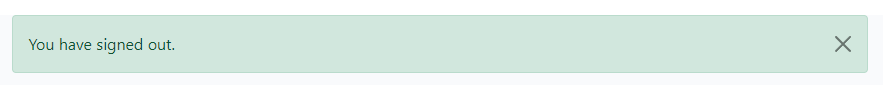

# MySport Blog

Stay ahead of the game with My Sport Blog News, your go-to source for the latest updates, insights, and analyses in the world of sports. Whether you're a die-hard fan, a casual follower, or an aspiring athlete, our blog covers everything from breaking news and match highlights to in-depth features and exclusive interviews.

- Link to deployed site - [https://my-sportblog-d25b82c351ce.herokuapp.com/](https://my-sportblog-d25b82c351ce.herokuapp.com/)
- Link to GitHub repository - [https://github.com/baselhn-cmd/mysportblog-pp4](https://github.com/baselhn-cmd/mysportblog-pp4)

## Table of Contents

- [My sport blog](#my-sport-blog)
  - [Table of Contents](#table-of-contents)
  - [Wireframes](#wireframes)
  - [Post and Comment Relationship Diagram](#post-and-comment-relationship-diagram)
  - [User Stories](#user-stories)
  - [Features](#features)
  - [Technologies Used](#technologies-used)
  - [Future Features](#future-features)
  - [Setting up Django](#setting-up-django)
  - [Deploying to Heroku](#deploying-to-heroku)
  - [Testing](#testing)
    - [Manual Testing](#manual-testing)
  - [Bugs](#bugs)
    - [Django Testing](#django-testing)
    - [Automated Testing](#automated-testing)
  - [Credits](#credits)
    - [Content](#content)
    - [Media](#media)
    - [Libraries \& Frameworks](#libraries--frameworks)
    - [Acknowledgements](#acknowledgements)
  
## Wireframes

- At the start of the project, I created some basic wireframes to visualize the design I had in mind for the site. I used moqups.com to develop these wireframes, covering the home page, sign-in, signup, and about pages.

Wireframe Home
 

Wireframe Sign Up

Wireframe Login

Wireframe About
  

 

## Post and Comment Relationship Diagram

- Initial plan

Post and comment relationship model

Post Model

Comment Model

## User Stories

- As a site user, I can view a paginated list of posts so that I can select which post I want to view.
- As a Site User / Admin, I can view comments on an individual post so that I can read the conversation.
- As a Site User I can register an account so that I can comment on a post.
- As a Site User I can leave comments on a post so that I can interact with the listings
- As a Site User I can modify or delete my comment on a post.
- As a Site Admin I can create, read, update and delete posts so that I can manage the listings.
- As a Site Admin I can create draft posts so that I can finish writing the content later.
- As a Site Admin I can approve or disapprove comments so that I can filter out objectionable comments.

## Features

- Pagination  The posts are paginated so that the user can view 6 posts per page. There is a link to the next page at the bottom of the page. When the user is not on the first page of listings, there is a link to the previous page.

Pagination

- Navbar
The navbar is anchored to the top of the page, providing effortless navigation throughout the site. It features a concise set of essential links, including:

Home page
About page
Login/Logout page
Register page
This design ensures that users can quickly access key sections of the website, enhancing overall usability and user experience

Navbar

- Login Status 

A prominent banner, situated below the navigation buttons, dynamically displays the user's login status, clearly indicating whether they are:

Logged in
Not logged in
This intuitive feature keeps users informed about their current login state, ensuring a seamless and personalized experience on the site.

Login Status

- About Page This site talking about the developer 

- Register Page

Register

- Login Page

Login

- Logout Page

Login

## Technologies Used

The project leverages a range of technologies to create a robust and scalable web application. Here's a breakdown of the technologies used:

### Frontend
HTML: Provides the structure and content of the site
CSS: Styles the site using Bootstrap and Google Fonts
JavaScript: Links buttons to functionality and enhances user interaction
### Backend
Python: Powers the backend of the site using Django as the web framework
Deployment and Version Control
Heroku: Hosts the application and provides a scalable infrastructure
Git: Manages version control and tracks changes to the codebase
GitHub: Stores the code and facilitates project planning and collaboration
### Database
Postgres: Serves as the database management system for the project
ElephantSQL: Hosts the database and provides a reliable storage solution
### Design and Assets
Draw.io: Creates wireframes and visualizes the site's layout and design
Cloudinary: Hosts images and provides a scalable media storage solution

## Future Features

- The next feature of the site will be like the post i´m working on but it´s not done yet

Setting Up Django: A Step-by-Step Guide

To set up Django for my site, I followed these steps:

Installation of Required Packages
I installed the necessary packages, including Django, Gunicorn, Psycopg2, Django Heroku, Django Crispy Forms, Pillow, Cloudinary, DJ Database URL, and Whitenoise.

Creating a New Django Project and App
Next, I created a new Django project and app, laying the foundation for my site.

Database Setup and Superuser Creation
I migrated the database and created a superuser to manage the site's admin tasks.

Configuration Files
I created a Procfile and a requirements.txt file, which are essential for deploying the app on Heroku.

Admin Account and Models
I created an admin account and defined the models for the site, then migrated the database again to apply the changes.

Database Hosting and Connection
I used Elephantsql to host the database and connected it to the site using a newly created instance. The DJ Database URL package helped link the database to the site.

Views, URLs, Templates, and Static Files
I created the views and URLs for the site, followed by the templates and static files.

Forms and Heroku Deployment
I created the forms for the site and then logged into Heroku to create a new app. I linked the app to my code base via GitHub and deployed it early to monitor for any bugs during the build process. By redeploying the app, I ensured everything was working as expected.

Config Vars and Final Touches
Finally, I added the necessary config vars to Heroku to connect the database and Cloudinary image hosting, completing the setup process.

## Deploying to Heroku
To deploy the app on Heroku, I followed these steps:

- Creating a New Heroku App
I started by creating a new app on Heroku, which would serve as the platform for hosting my application.

- Linking to GitHub Repository
Next, I connected the Heroku app to my GitHub repository, allowing me to manage my codebase and track changes.

- Configuring Environment Variables
I then added the necessary config vars to Heroku, which enabled me to connect the database and Cloudinary image hosting to the app.

- Manual Deployment and Testing
In the deploy section, I manually deployed the app and closely monitored the build process for any bugs or issues. By redeploying the app and verifying that everything was working as expected, I ensured a smooth and successful deployment.

## Testing

### Manual Testing

|        Component     |       Test       |     Expected Result.      |           Actual Result         |
|----------------------|------------------|---------------------------|---------------------------------|
| Home page display as expected | Click on Home | Home page displayed | Home page with job listings and images visible. **PASS**  |
| About page link working | Selected About link | About page to display | About page displayed. **PASS** |
| About page displays | Click on About | About page to display as expected | About page displayed paragraph about the site and the table to contact admin. **PASS** |
| Form to register interest | Fill in all form fields | Alert renders on admin about page | Alert appeared on admin and about page. **PASS** |
| Form fields | Skip completing form fields | Alert to please fill in field.  | Alert appeared to fill in field. **PASS** |
| Email form field | Fill in email in incorrect format | Alert to include @ in email | Alert appeared to include @ for email. **PASS** |
| Work list display | Click on home | List of blog posts appears as 6 per page | List of work post displayed as 6 per page. **PASS** |
| Next and Prev Buttons | Work as expected | Next brings to next page, prev brings to previous | Next brought to next page, previous brought to previous lisings. **PASS** |
| Full Listing display | On click of listing title in blog list full listing display | Full listing displays | Full listing displayed. **PASS** |
| Comment Counter | Scroll to comment section | Shows users a small graphic with number of comments | Displays correctly. **PASS** |
| Log in Prompt | To display when not log in | Message display in like and comment to prompt a log in | Messaged displayed to visitor to log in to interact with post. **PASS** |
| Like Log in Prompt Link Working | Link to sign in page working | User brought to sign in page when clicked | User is brought to log in page when link. **PASS** |
| Comment | Site User can leave a comment | User can leave a comment and receive confirmation | Member placed comment and received notification that comment is awaiting approval. **PASS** |
| Not logged in Comment | If not logged in cannot comment | Message displaying to prompt visitor to log in if they want to leave a comment | Message displayed to visitor to sign in to leave comment. **PASS** |
| Comment Log in Link | Link working | On click of link user brought to sign in page | User clicked log in link and brought to log in page. **PASS** |
| Edit Comment | Can only edit own comment | Only users own comment can be edited | User could only edit their comment and receive an alert to state they did so. **PASS** |
| Delete Comment | Users can delete own comments | Users can delete comment once confirmation received | User could delete a comment they left once confirming they were happy to do so. **PASS** |
| Sign Up Form | Working as expected | New user created as a result | All fields of form completed and new user created. **PASS** |
| Log In Link on Sign Up page | Link working | On click log in link brings to log in page | User brought to log in page once clicked. **PASS** |
| Sign In Field Validation | Field Validation | Alert user if field missed | Field missed on completing form and alert received to fill in missing field. **PASS** |
| Password Validation | Password | Alert raised if criteria not met | Alert raised as a result of not matching password or too similar to user name. **PASS** |
| Log In Form | Allows user to sign in | User can sign in and gain full functionality of blog | User signed in successfully when correct credentials supplied. **PASS** |
| Sign Up Link on Log In Page | Link working | On click brought to sign up page | User brought to log in page once clicked. **PASS** |
| Sign Out | User can sign out | Sign out successfully and asked to confirm | User could sign out once they confirmed that was their intention. **PASS**|

## Bugs
